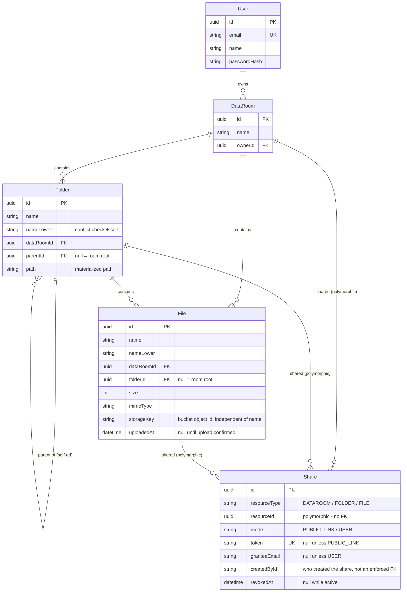

# Data Room

A virtual data room for due diligence: nested folders, PDF upload and viewing, and read-only sharing (public link or per-email) with revocation.

**Live:**
- Web: https://virtual-data-room-two.vercel.app
- API: https://virtual-data-room-production-8114.up.railway.app (liveness: `/health`)

## Demo accounts

| Role | Email | Password |
|---|---|---|
| Owner | `owner@demo.test` | `UzDVbBRSuMCYGESB` | 
| Viewer (share recipient) | `viewer@demo.test` | `KbdhvDnzXD50qJlj` |

The owner account has a data room with nested folders, a few PDFs, and shares already handed out. The viewer account has a shared room and a separately shared folder and file in "Shared with me" - both sides of sharing are visible without registering. Feel free to register your own account instead if you'd rather see the empty-state flow, or if someone before you has rearranged the demo content.

These passwords are one-time, used only for this demo, and not reused anywhere else.

There's no seed script - a `File` row is meaningless without a matching object in the storage bucket, so seeding would need the same upload machinery the app already has. The demo accounts and their content were created once, by hand, through the deployed UI - which doubles as the final end-to-end walkthrough (register → folders → upload → rename → move → share → revoke → delete) before shipping.

## Stack

- **Web** - React 19, TypeScript, Vite, Tailwind 4, shadcn/ui, TanStack Query. Deployed on Vercel.
- **API** - NestJS 11, Prisma, PostgreSQL. Deployed on Railway.
- **File storage** - Supabase Storage, private bucket, signed URLs only (the API never proxies file bytes).
- **Auth** - email/password, JWT.
- Two independent `package.json` (`apps/web`, `apps/api`), no monorepo tooling - deliberate, the project is small enough that a build orchestrator would be pure overhead.

## Running locally

Requirements: Node 20.19+ (or 22.12+), a PostgreSQL database (this project targets Supabase's Postgres, including its connection pooler), a Supabase Storage bucket.

### API (`apps/api`)

```bash
cd apps/api
npm install
cp .env.example .env   # fill in the values below
npx prisma migrate dev
npm run start:dev
```

Env vars (see `.env.example`):

| Variable | Purpose |
|---|---|
| `DATABASE_URL` | Supabase's **transaction pooler** (port 6543). Must include `?pgbouncer=true&connection_limit=1` - without it, Prisma's prepared statements collide on a pooled connection and queries intermittently fail with `prepared statement "s0" already exists`. |
| `DIRECT_URL` | Supabase's **direct/session** connection (port 5432), used only by `prisma migrate`. |
| `SUPABASE_URL` / `SUPABASE_SERVICE_ROLE_KEY` / `SUPABASE_BUCKET` | Storage bucket the API issues signed upload/view/download URLs against. The bucket must allow `PUT` and the `apikey`/`x-upsert` headers in its CORS config, or uploads fail silently in the browser. |
| `JWT_SECRET` | Signs the single access token (7-day expiry, no refresh - see "Cut from MVP" below). |
| `CORS_ORIGIN` | Comma-separated allowed origins for the web app. Defaults to allow-all if unset - fine locally, set it explicitly in production. |
| `PORT` | Defaults to `3000`. |

`npm install` also generates the Prisma client (via `@prisma/client`'s own postinstall hook) - no separate `prisma generate` step needed. `npm run build && npm run lint && npm test` before pushing.

### Web (`apps/web`)

```bash
cd apps/web
npm install
cp .env.example .env   # fill in the values below
npm run dev
```

| Variable | Purpose |
|---|---|
| `VITE_API_URL` | Base URL of the API (e.g. `http://localhost:3000` locally). |
| `VITE_SUPABASE_ANON_KEY` | Sent as the `apikey` header when the browser uploads a file directly to the signed Supabase Storage URL the API hands back - the anon key is safe to ship to the client, it only authorizes the specific signed operation. |

`npm run build && npm run lint` before pushing.

## Project decisions

**Presigned uploads, not proxied bytes.** The API never touches file contents. It issues an upload intent (ownership + MIME type + size check) and a Supabase signed URL; the browser `PUT`s the file straight to storage and then calls back to confirm. This keeps the API stateless with respect to file size and avoids ever holding a multi-hundred-MB PDF in server memory. View/download URLs are short-lived (5 minutes) so revoking a share actually revokes access; the upload URL itself doesn't need that constraint, since it's only usable to write the one object it was issued for.

**Materialized path for the folder tree.** Every `Folder.path` stores the chain of ancestor folder ids as a slash-separated string ending in the folder's own id (a folder two levels deep has path `grandparentId/parentId/selfId/`) - the room id isn't part of it, that boundary is tracked separately. Subtree operations - delete-preview counts/size, share inheritance, breadcrumb trimming - are a single `path LIKE 'prefix%'` query with an index on `path`, not a recursive CTE. The trade-off is that moving a folder would need to rewrite `path` on its whole subtree; folder move isn't implemented (see below), so this hasn't been exercised in practice yet.

**`storageKey` is independent of the file name.** It's a UUID assigned at upload, never derived from or updated by the display name. Renaming a file is a single DB row update; the bucket object is untouched.

**Sharing is one polymorphic table.** `Share` has `resourceType` (`DATAROOM`/`FOLDER`/`FILE`) + `resourceId` with no foreign key - a share can point at any of the three resource types. `mode` picks public-link vs per-email; access resolution (`resolveAccess`) walks the target resource's own ancestor chain (built from the same materialized path) and checks whether any active share covers a node in that chain, which is how "share a folder" implies read access to everything nested inside it without a separate inheritance table.

**Email/password, not OAuth.** A reviewer opening this cold shouldn't need to configure an OAuth app or redirect URI just to log in. Simpler surface, one less deployed dependency.

**Deliberately cut from MVP:**
- **Refresh tokens.** A single 7-day JWT, no rotation or silent refresh. A leaked token is valid until it expires; there's no server-side revocation short of changing the secret. Acceptable for a demo, not for production.
- **Cleanup of abandoned uploads.** An upload intent creates a `File` row before the browser finishes `PUT`ing the bytes; if the tab closes mid-upload, that row (and, in rarer partial-write cases, a bucket object) never gets a `completeUpload` call and never gets garbage-collected. It's filtered out of every listing (`uploadedAt: null`), so it's invisible to users, but it lingers in the database and possibly the bucket.
- **Moving a folder.** Files can be moved between folders; folders themselves can be renamed and deleted, but not relocated into a different parent. The materialized-path design above supports it, but the mutation (rewriting `path` on a whole subtree, and re-checking name conflicts at the destination) wasn't built.
- **Search and versioning** - both explicitly optional in the assignment, not started; see "How it scales" below for the shape a search index would take.

## Data model



`Share.resourceId` deliberately has no foreign key - it can reference `DataRoom`, `Folder`, or `File` depending on `resourceType`, and a share outlives the row it points at (a deleted resource leaves a dangling share, which read paths filter out rather than treat as an error). `Folder` and `File` both carry a nullable `folderId`/`parentId` - `null` means "lives at the room's root" rather than needing a separate root marker row.

## How it scales

**Aggregate size and item count for a folder, including its whole subtree.** Today: a raw SQL aggregate over `path LIKE 'prefix%'` (backing the delete-preview panel), using the index on `path` - one query, no recursion, regardless of tree depth. This is fine for an occasional pre-delete check but doesn't scale to showing "size" on every folder row in a listing, since each row would trigger its own subtree scan. The next step is denormalized counters (`size`, `itemCount`) stored directly on `Folder`, updated either transactionally inside each mutation (folder create/delete, file upload/delete/move) for immediate consistency at the cost of extra lock contention on deep trees, or asynchronously via a queue for cheaper writes at the cost of a brief staleness window. Either way the read path stays O(1) per folder instead of O(subtree size).

**100,000 files in one data room.** Already the operating assumption, not a hypothetical: every listing endpoint returns one folder level at a time (never the whole room flattened), paginated with keyset cursors over composite indexes - `(dataRoomId, parentId, nameLower, id)` for folders, `(dataRoomId, folderId, nameLower, id)` for files, `(resourceType, resourceId, createdAt, id)` / `(granteeEmail, createdAt, id)` for shares - so a page costs `O(page size)` regardless of how many siblings exist, and no listing endpoint runs `COUNT(*)` over the room (the delete-preview subtree aggregate is the one deliberate exception, and it's not on a list-rendering path). What's genuinely missing at that scale is name search across the whole room; the assignment lists it as optional, and the honest answer for when it's needed is a trigram index (`pg_trgm`) rather than `LIKE '%x%'`, since a B-tree on `nameLower` only accelerates prefix matches.

**Viewer/editor roles.** `Share` doesn't need to change shape - it's already one row per (resource, recipient) grant, so a role is one more column on that same row, not a redesign. The change is additive: add `role` back to the schema (`VIEWER`/`EDITOR`, defaulting existing rows to `VIEWER` - a non-breaking migration), widen `AccessLevel`'s union to include `EDITOR`, and have `resolveAccess` read `share.role` into the level it returns instead of collapsing every share to `VIEWER`; the mutation endpoints that currently hardcode a required level of `OWNER` widen to also accept `EDITOR`, while share management and room-level actions stay owner-only. (An earlier pass at this schema had exactly that column, unused - removed during review, since an unused enum reads as an unfinished feature rather than a real one. The honest answer to "how would you add it" is a small additive migration, not a flag to flip.) Growing further - a default role per room, or shares granted to a group rather than one email - builds on the same row shape, just a different `granteeEmail` resolution step.

## Where AI was used

Built with Claude Code end to end, using a small fixed roster of subagents (backend, frontend, test-writer, reviewer, spec-checker) rather than one undifferentiated assistant - most feature work was drafted by the backend/frontend agents against an API contract fixed up front, then checked by an automated review pass and a pass that reconciled the diff against the assignment's actual requirements before calling anything done.

All application code here is agent-written; my side of the work was the task breakdown, the architectural decisions, the API contracts fixed before generation started, and a review of every diff with targeted point fixes (plus commits, migrations, and prod checks - all banned for the agent). The access-control core (`resolveAccess`, the materialized-path-to-ancestor-chain logic that both authenticated and public-token routes share) and the overall sharing design were not handed off to an implementation subagent - that part was written in the main orchestrating session and got the densest review, since a bug there is a data leak, not a UI glitch. Keyset pagination was built once and then applied identically to every list endpoint by the agents once the pattern existed.

Where it got it wrong, concretely: a public "view" endpoint quietly forced a file download instead of rendering it inline from the very first implementation - caught by re-reading my own spec, not by a reviewer; a share-list pagination change hid a resource's public link (and any newly-added recipient) behind a second page that the UI never fetched by default, which took two separate review passes to fully close because the first fix only solved half of it; and a breadcrumbs endpoint that, for a viewer whose access came from a share on a deep folder, returned the names of parent folders above the share boundary - not a permissions bypass, but a real information leak (showing names the viewer had no right to see), caught before shipping. None of these were "the AI can't code" failures - they were correctness edges an automated pass didn't reason through, which is exactly why review stayed mandatory on every change rather than optional for the ones that "looked simple."

A fuller note on the process and the concrete mistakes caught along the way: [ai-usage-notes.md](./ai-usage-notes.md) (in Ukrainian).
